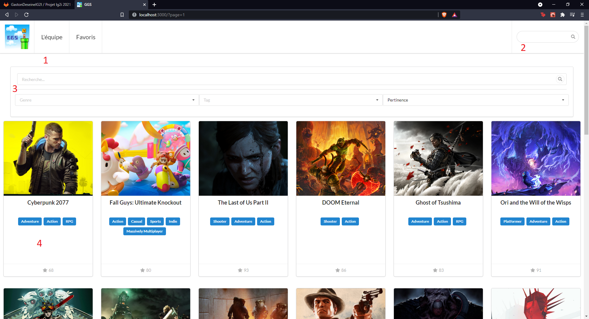

# Compte rendu projet React - Carlier Deseine Lesueur

## Introduction

En tant que dernier projet de l'année mais aussi pour clôturer le cours de React, nous devons réaliser une Single Page Application d'un site de référencement de jeux vidéos.

Vous trouverez le sujet et les différentes contraintes dans le [cahier des charges](projet.md).

## Installation

Afin d'installer le projet, il faut le cloner depuis le repo :

```bash
mkdir ~/projet-ggs
git clone https://framagit.org/GastonDeseineIG2I/projet-ig2i-2021.git ~/projet-ggs
cd ~/projet-ggs
```

Maintenant, on installe les différentes dépendances et on démarre le projet via les commandes suivantes : 

```bash
npm install
npm start
```

Une fenêtre de navigateur est automatiquement ouverte avec le projet.

## Projet

Le projet, comme demandé dans le cahier des charges, se découpe en 4 pages principales, sous découpées elles mêmes en plusieurs sous modules.

### Accueil - GameList

La page principale du projet est la liste de jeux et se présente comme suit :



- 1 : Le menu de notre application, on y retrouve notre magnifique logo, qui redirige vers cette page.

  L'onglet "L'équipe" redirige vers la présentation des membres de notre équipe

  L'onglet favoris renvoie vers la liste des favoris, que l'on peut ajouter soit sur cette vue en passant sa souris sur une image d'un jeu, ou sur la page des détails, que nous présenterons par la suite.

- 2 : Barre de recherche, la saisie permet de chercher des jeux et l'affiche dans une liste déroulante pour rediriger vers la page détails du jeu en question.

Ces deux éléments représentent notre barre de menu, qui nous suivra tout au long de l'application.

- 3 : Filtres de recherche, selon le nom du jeu, un filtre par genre, par tags ainsi qu'un tri par plusieurs critères (pertinence, date de sortie ou note metacritic)
- 4 : Liste des jeux selon les critères de recherche (s'il n'y a pas de filtres, les jeux ayant une note > 50 et sortis après janvier 2020)

Cette liste est paginée avec 20 éléments par page.


### Details d'un jeu - GameDetails

En cliquant sur une carte de la liste ou via la barre de recherche du menu, la page de détails du jeu en question s'affiche avec tout un ensemble d'informations 


On dispose d'un panel d'informations comme 

- l'image du jeu

- la description

- divers screenshots qui peuvent être agrandis

  

- l'ensemble des plateformes sur lesquels le jeu est jouable.

De plus, il est possible d'ajouter le jeu aux favoris via l'étoile sur le titre du jeu.

### Favoris - FavList

La liste des favoris reprend la structure de la liste mais avec les jeux marqués comme favoris au travers des deux vues précédentes.


Il est également possible de supprimer les jeux de la liste via les deux mêmes précédentes vues ou via la liste directement en passant sa souris sur l'image, ce qui dévoile une étoile permettant de retirer le jeu de la liste, tout comme sur l'accueil.

### Équipe - Team

Enfin, via la page de présentation de l'équipe, on retrouve l'ensemble des membres ayant participés au projet. 


De plus, il est possible de cliquer sur chaque membre pour avoir des détails, une liste de jeux plus détaillée par personne.


## Conclusion

Ainsi, nous avons pu au travers de ce projet consolider et approfondir l'ensemble des notions abordées pendant les différents cours et TPs. 

Nous sommes parvenus à remplir la totalité du cahier des charges avec le petit bonus de la barre de recherche dans le menu, qui permet d'accéder à un jeu à partir de la saisie de son nom.

Nous avons fait le choix d'utiliser [Semantic UI](https://react.semantic-ui.com/) pour mettre en forme notre application afin de faciliter et accélérer la mise en place d'éléments front end stylisés. De plus, cela nous a été très utile pour des sujets comme le loader ou la-dite barre de recherche.
